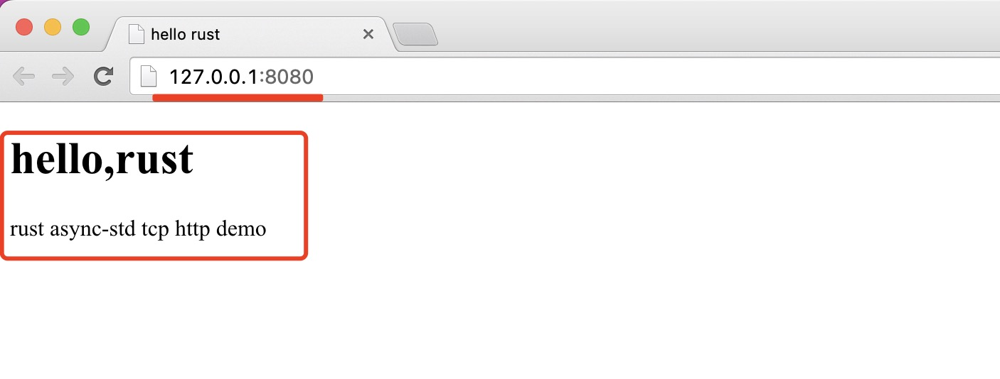

# tcp-http-demo
    一个多线程并行和并发处理请求的http demo
    使用futures和async-std 运行时crate实现的简单http 并发服务器

# 运行效果
在浏览器中输入：http://127.0.0.1:8080/


# async-std spawn 并发函数的底层签名
```rust
pub fn spawn<F, T>(future: F) -> JoinHandle<T>
where
F: Future<Output = T> + Send + 'static,
T: Send + 'static,
{
    Builder::new().spawn(future).expect("cannot spawn task")
}
```

# mock TcpStream和unit test
```rust
// unit test 单元测试
// 为了保证单元测试的个理性和程序运行的确定性，我就使用MockTcpStream来模拟tcp请求
// 这里实现了impl Read + Write + Unpin 等特征
#[cfg(test)]
mod tests {
    use super::*;
    use futures::io::Error;
    use futures::task::{Context, Poll};
    use std::cmp::min;
    use std::pin::Pin;

    // 模拟tcp stream
    struct MockTcpStream {
        read_data: Vec<u8>,
        write_data: Vec<u8>,
    }

    // 实现read trait 里面的poll_read方法
    impl Read for MockTcpStream {
        fn poll_read(
            self: Pin<&mut Self>,
            _: &mut Context<'_>,
            buf: &mut [u8],
        ) -> Poll<std::io::Result<usize>> {
            let size: usize = min(self.read_data.len(), buf.len());
            // 将数据拷贝到buf缓存中
            buf[..size].copy_from_slice(&self.read_data[..size]);
            Poll::Ready(Ok(size)) // 表明read请求已处理成功
        }
    }

    // 为 MockTcpStream 实现Write特征，需要实现三个方法 poll_write，poll_flush，poll_close
    impl Write for MockTcpStream {
        // 拷贝输入数据到mock的TcpStream中，完成后返回Poll::Ready
        fn poll_write(
            mut self: Pin<&mut Self>,
            _: &mut Context,
            buf: &[u8],
        ) -> Poll<Result<usize, Error>> {
            self.write_data = Vec::from(buf);
            Poll::Ready(Ok(buf.len()))
        }

        // 由于TcpStream无需flush和close，所以下面的方法直接返回了Poll::Ready
        fn poll_flush(self: Pin<&mut Self>, _: &mut Context<'_>) -> Poll<std::io::Result<()>> {
            Poll::Ready(Ok(()))
        }

        fn poll_close(self: Pin<&mut Self>, _: &mut Context<'_>) -> Poll<std::io::Result<()>> {
            Poll::Ready(Ok(()))
        }
    }

    // 实现 Unpin 移动特征，表示它可以在内存中安全的移动
    use std::marker::Unpin;
    impl Unpin for MockTcpStream {}

    // 下面的 #[async_std::test] 作用和 #[async_std::main] 作用一样，将test函数转换为异步函数执行
    use std::fs;
    #[async_std::test]
    async fn test_handle_connection() {
        let input_bytes = b"GET / HTTP/1.1\r\n";
        // 将数据写入contents中
        let mut contents = vec![0u8; 1024];
        contents[..input_bytes.len()].clone_from_slice(input_bytes);

        // 初始化MockTcpStream用来创建tcp mock stream
        let mut stream = MockTcpStream {
            read_data: contents,
            write_data: Vec::new(),
        };

        // 处理请求
        handle_connection(&mut stream).await; // 等待请求执行完毕

        // 读取数据到buf中
        let mut buf = [0u8; 1024];
        stream.read(&mut buf).await.unwrap();

        let expected_contents = fs::read_to_string("hello.html").unwrap();
        let expected_response = format!("HTTP/1.1 200 OK\r\n\r\n{}", expected_contents);
        // 判断请求的数据和期望的数据是否一致
        assert!(stream.write_data.starts_with(expected_response.as_bytes()))
    }
}
```
