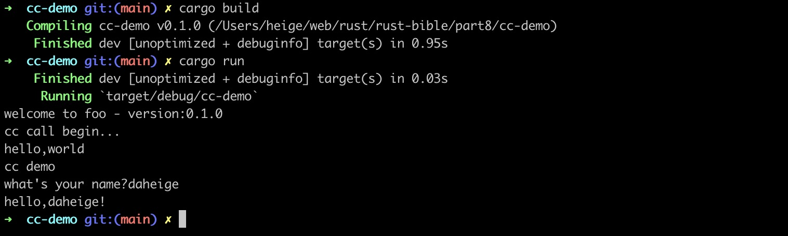

# 通过cc运行在rust中调用c语言提供的函数

ffi调用参考： https://doc.rust-lang.org/nomicon/ffi.html

构建依赖如下：

```toml
[build-dependencies]
cc = "1.0.95"
```

执行cargo check 和 cargo run运行效果如下图所示：


# 参考文档

- https://llever.com/rust-cookbook-zh/development_tools/build_tools.zh.html
- https://rustwiki.org/zh-CN/rust-cookbook/development_tools/build_tools.html
- https://nomicon.purewhite.io/ffi.html
- https://docs.rs/cc/latest/cc/struct.Build.html#method.compile
