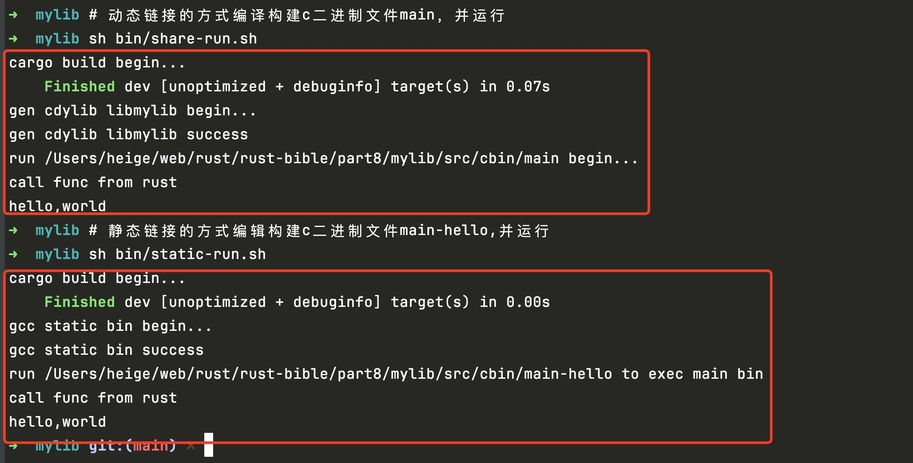

# 在c语言中调用rust代码

1. 通过cargo new --lib mylib生成一个rust library库
2. 在Cargo.toml中添加如下内容配置

```toml
[lib]
name = "mylib" # 链接库名字
#配置 Rust 生成两种库——静态库（staticlib）和 C动态库（cdylib）
crate-type = ["staticlib", "cdylib"]
```

3. 在lib.rs添加如下代码

```rust
// 关闭混淆功能以让c程序可以找到调用的函数
// extern 默认导出为C ABI
#[no_mangle]
pub extern "C" fn say_hello() {
    println!("call func from rust");
    println!("hello,{}", "world");
}
```

上述代码定义了rust say_hello函数

4. 在src目录下新建一个mylib.h头文件，添加如下代码：

```c
// mylib.h
// 为了给 C 调用我们还需要编写一个头文件
// 在这个头文件中定义函数签名
void say_hello();
```

5. 在src目录下新建一个main.c文件，添加如下代码：

```c
// main.c
// 引入c语言的头文件
#include
"mylib.h"

int main() {
// 调用rust mylib库中的say_hello函数
// 在编译的时候可以选择是用动态链接或静态链接的方式来生成c语言的二进制文件
// 具体生成机制看bin/share-run.sh和static-run.sh即可
say_hello();
}
```

6. 开始编译，这里我使用采用shell脚本的方式实现cargo build和gcc编译
7. 执行如下shell脚本运行程序

```shell
# 动态链接的方式编译构建c二进制文件main，并运行
sh bin/share-run.sh

# 静态链接的方式编辑构建c二进制文件main-hello,并运行
sh bin/static-run.sh
```

运行效果如下图所示：

从图中可以看出，c动态链接和静态链接libmylib的两种方式，都是可以正常运行成功的。
本示例通过编写rust代码，并通过ffi调用的方式，在c语言中实现了调用rust编写的代码，这种ffi调用的思路，为c和rust的互通性提供了便利。
关于rust中如何调用c/c++代码，你可以看part8/cc-demo和part8/cc-cpp-demo，这两个示例中有详细的使用方法，希望对你学习ffi调用有所启发和帮助。

